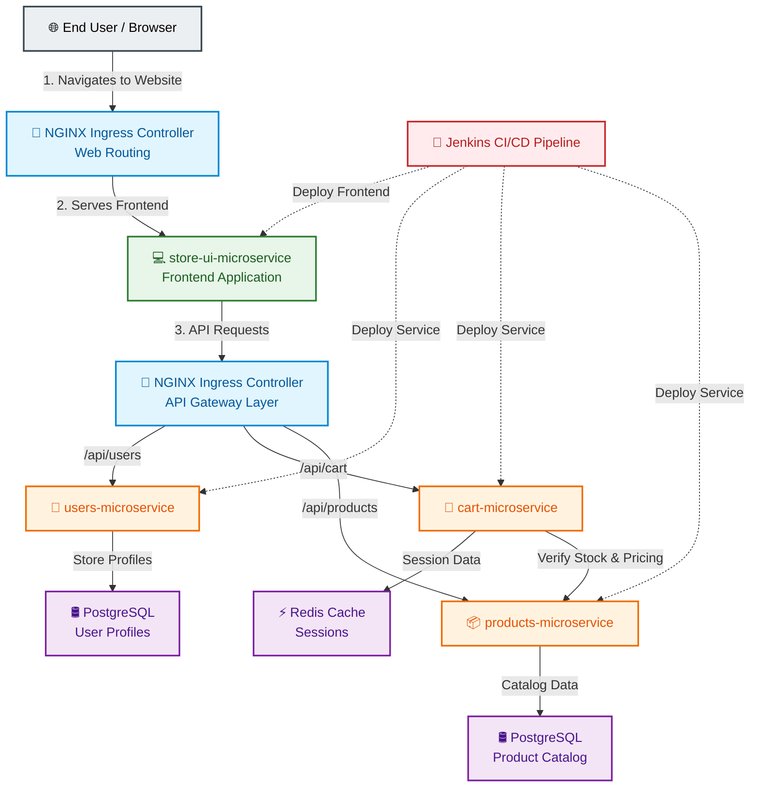

# StreamlinePay



Production-grade microservices payment platform. Rebuilt from a fragile deployment into a fully automated, secure, and scalable system using Kubernetes, GitOps, and security-first CI/CD.


Four microservices (Node.js, Python, Java, React) running on Kubernetes. Single PostgreSQL database. Built as Docker containers, scanned with Trivy, pushed to AWS ECR.

## How It Works

**Development:** Push code → Jenkins webhook triggers build  
**Build:** Docker builds each service in parallel, Trivy scans images, pushes to ECR with commit SHA tag  
**Deployment:** Jenkins updates Helm values in `agrocd-yaml` repo → ArgoCD detects Git change → Syncs EKS cluster  
**Rollback:** `git revert` in deployment repo + manual sync

Everything is declarative. Git is the source of truth.

## The Four Services

- **products-microservice** (Node.js/Express) — Product catalog
- **users-microservice** (Python/FastAPI) — User management
- **cart-microservice** (Java/Spring Boot) — Shopping cart
- **store-ui-microservice** (React/Nginx) — Frontend

Each has a Dockerfile. Each gets scanned before ECR push. Each has `/health` endpoint.

## Tech Stack

**Orchestration:** Kubernetes 1.27+ (AWS EKS)  
**Container Registry:** AWS ECR  
**CI/CD:** Jenkins (declarative pipelines)  
**Security:** Trivy scanning, least-privilege IAM  
**GitOps:** ArgoCD with Helm charts  
**Infrastructure as Code:** Terraform (separate repo: `stream-infra-clean`)  
**Deployment Manifests:** Helm + ArgoCD (separate repo: `agrocd-yaml`)

## Quick Start

### Build
```bash
git clone https://github.com/maxiemoses-eu/StreamlinePayX-3.git
cd StreamlinePayX-3

# Build each service (tag with commit SHA)
COMMIT=$(git rev-parse --short HEAD)
docker build -t products-microservice:$COMMIT ./products-microservice
docker build -t users-microservice:$COMMIT ./users-microservice
docker build -t cart-microservice:$COMMIT ./cart-microservice
docker build -t store-ui-microservice:$COMMIT ./store-ui-microservice
```

### Push to ECR
```bash
# Authenticate Docker to ECR
aws ecr get-login-password --region us-east-1 | \
  docker login --username AWS --password-stdin ACCOUNT_ID.dkr.ecr.us-east-1.amazonaws.com

# Tag and push (example for products service)
docker tag products-microservice:$COMMIT ACCOUNT_ID.dkr.ecr.us-east-1.amazonaws.com/products-microservice:$COMMIT
docker push ACCOUNT_ID.dkr.ecr.us-east-1.amazonaws.com/products-microservice:$COMMIT
```

### Deploy
Jenkins handles the rest—it updates image tags in `agrocd-yaml`, ArgoCD syncs the cluster.

Manual sync if needed:
```bash
kubectl get pods -n streamlinepay
kubectl logs -f deployment/products-microservice -n streamlinepay
```

## Pipeline

Jenkins Jenkinsfile orchestrates the flow:
1. Checkout code
2. Build Docker images (parallel)
3. Trivy scan each image (fails on HIGH+)
4. Push to ECR
5. Update Helm values in agrocd-yaml
6. ArgoCD auto-syncs EKS

**Why split repos?**
- `StreamlinePayX-3`: Application code + CI logic
- `stream-infra-clean`: Infrastructure (Terraform)
- `agrocd-yaml`: Deployment config (Helm + ArgoCD)

Decoupling prevents conflicts and lets different teams own different concerns.

## Security

- **Images scanned before push** — Trivy blocks HIGH/CRITICAL vulnerabilities
- **IAM least privilege** — Jenkins can only push to ECR, nothing else
- **Git as control plane** — All changes auditable, rollbacks are git reverts
- **Cluster isolation** — Services communicate via internal Kubernetes DNS

## Current Status

✅ **Build & Deployment:** Fully automated  
✅ **Security Scanning:** Working (fails on vulns)  
⚠️ **Some services timing out on health checks** — Debugging (likely port or probe config)  
⚠️ **Metrics/Dashboards:** Prometheus + Grafana coming  
⚠️ **Log aggregation:** Planned  

Not blockers—improvements queued.

## Troubleshooting

**Pod in CrashLoopBackOff?**
```bash
kubectl logs -f pod/products-microservice-xyz -n streamlinepay
kubectl describe pod products-microservice-xyz -n streamlinepay
```

**Jenkins build failed?**
Check GitHub webhook delivery → Recent Deliveries, or manually trigger in Jenkins UI.

**ArgoCD out of sync?**
```bash
argocd app sync products-app
```

## Further Reading

Full architectural decisions, trade-offs, and why we rebuilt from scratch:

📖 **[Case Study: How I Rebuilt StreamlinePay](https://medium.com/@MaxieMoses/how-i-rebuilt-streamlinepay-a-complete-aws-devops-and-gitops-case-study-9dd0a2964041)**

## Repos

- **[StreamlinePayX-3](https://github.com/maxiemoses-eu/StreamlinePayX-3)** — Application + CI
- **[stream-infra-clean](https://github.com/maxiemoses-eu/stream-infra-clean)** — Infrastructure (Terraform)
- **[agrocd-yaml](https://github.com/maxiemoses-eu/agrocd-yaml)** — Deployment (Helm + ArgoCD)

## Author

**Maxie Moses** | DevOps Engineer  
[LinkedIn](https://www.linkedin.com/in/maxie-moses-a-26a2788b/) • [Medium](https://medium.com/@MaxieMoses) • [GitHub](https://github.com/maxiemoses-eu)

---

**Status:** Production-ready (observability in progress)