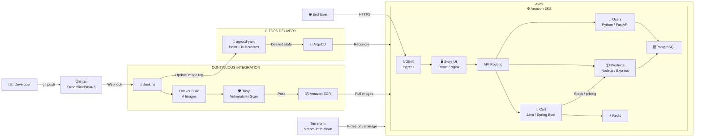

# StreamlinePay

### Kubernetes · AWS EKS · Terraform · Jenkins · ArgoCD · Helm · Docker · Trivy

**StreamlinePay is a containerized microservices platform running on Amazon EKS, with AWS infrastructure managed through Terraform and application delivery implemented through Jenkins CI and GitOps with ArgoCD.**

The platform separates three concerns:

```text
APPLICATION          INFRASTRUCTURE          DEPLOYMENT
     │                      │                     │
     ▼                      ▼                     ▼
StreamlinePayX-3      stream-infra-clean     agrocd-yaml
     │                      │                     │
     ▼                      ▼                     ▼
Services + CI          Terraform + AWS       Helm + ArgoCD
```

---

## Architecture


```mermaid
flowchart LR

    %% =========================
    %% SOURCE
    %% =========================

    Dev["👨‍💻 Developer"]

    GitHub["GitHub<br/>StreamlinePayX-3"]

    Dev -->|"git push"| GitHub

    %% =========================
    %% CI
    %% =========================

    subgraph CI["CONTINUOUS INTEGRATION"]

        Jenkins["🔴 Jenkins"]

        Build["Docker Build<br/>4 Images"]

        Scan["🛡️ Trivy<br/>Vulnerability Scan"]

        Registry["📦 Amazon ECR"]

        Jenkins --> Build
        Build --> Scan
        Scan -->|"Pass"| Registry

    end

    GitHub -->|"Webhook"| Jenkins

    %% =========================
    %% GITOPS
    %% =========================

    subgraph GitOps["GITOPS DELIVERY"]

        Repo["📁 agrocd-yaml<br/>Helm + Kubernetes"]

        Argo["🔄 ArgoCD"]

        Jenkins -->|"Update image tag"| Repo
        Repo -->|"Desired state"| Argo

    end

    %% =========================
    %% AWS
    %% =========================

    subgraph AWS["AWS"]

        subgraph EKS["☸ Amazon EKS"]

            Ingress["NGINX<br/>Ingress"]

            UI["🖥️ Store UI<br/>React / Nginx"]

            API["API Routing"]

            Users["👤 Users<br/>Python / FastAPI"]

            Cart["🛒 Cart<br/>Java / Spring Boot"]

            Products["📦 Products<br/>Node.js / Express"]

            DB["🗄️ PostgreSQL"]

            Cache["⚡ Redis"]

            Ingress --> UI
            UI --> API

            API --> Users
            API --> Cart
            API --> Products

            Users --> DB
            Products --> DB
            Cart --> Cache
            Cart -->|"Stock / pricing"| Products

        end

    end

    Argo -->|"Reconcile"| EKS
    Registry -->|"Pull images"| EKS

    %% =========================
    %% INFRASTRUCTURE
    %% =========================

    Terraform["Terraform<br/>stream-infra-clean"]

    Terraform -->|"Provision / manage"| AWS

    %% =========================
    %% USER TRAFFIC
    %% =========================

    Browser["🌐 End User"]

    Browser -->|"HTTPS"| Ingress
```

### The delivery path

```text
CODE
  │
  ▼
GitHub
  │
  ▼
Jenkins
  │
  ├── Build
  ├── Scan
  └── Publish
          │
          ▼
       Amazon ECR
          
Jenkins ───────► GitOps Repository
                       │
                       ▼
                    ArgoCD
                       │
                       ▼
                    EKS
```

**Jenkins builds and publishes artifacts.
Git stores the desired deployment state.
ArgoCD reconciles that state into Kubernetes.**

Terraform operates on a separate lifecycle and manages the AWS infrastructure underneath the platform.

---

# Platform Overview

StreamlinePay consists of:

* **3 backend services**
* **1 frontend application**
* **PostgreSQL**
* **Redis**
* **NGINX Ingress**
* **AWS EKS**
* **Jenkins CI**
* **ArgoCD GitOps delivery**
* **Terraform-managed AWS infrastructure**

### Application services

| Service                 | Stack              | Responsibility    |
| ----------------------- | ------------------ | ----------------- |
| `products-microservice` | Node.js / Express  | Product catalogue |
| `users-microservice`    | Python / FastAPI   | User management   |
| `cart-microservice`     | Java / Spring Boot | Shopping cart     |
| `store-ui-microservice` | React / Nginx      | Web frontend      |

Each application component has its own Docker build context and is handled independently by the CI pipeline.

---

# Delivery Architecture

The CI/CD workflow is intentionally divided into **build** and **deployment** responsibilities.

### Continuous Integration

```text
GitHub
   │
   ▼
Jenkins
   │
   ├── Checkout
   │
   ├── Build containers
   │
   ├── Trivy scan
   │
   └── Push to ECR
```

Images are tagged with the source revision so an artifact can be traced back to the code that produced it.

### GitOps Delivery

```text
Jenkins
   │
   │ image reference
   ▼
agrocd-yaml
   │
   │ desired state
   ▼
ArgoCD
   │
   │ reconciliation
   ▼
Amazon EKS
```

Jenkins does **not** directly apply Kubernetes workloads.

Instead, it updates the deployment configuration in Git.

ArgoCD then reconciles the cluster against that desired state.

This keeps deployment configuration version-controlled and provides a clear audit trail for application changes.

---

# Infrastructure

AWS infrastructure is managed separately through:

**`stream-infra-clean`**

Terraform is responsible for the infrastructure layer while the application and deployment repositories remain independent.

```text
Terraform
    │
    ▼
AWS Infrastructure
    │
    ├── VPC
    ├── EKS
    ├── IAM
    └── Supporting resources
```

The separation allows infrastructure changes and application changes to follow independent lifecycles.

---

# Security

Security controls are integrated into the delivery workflow.

### Container scanning

Trivy scans container images before they are published to ECR.

The pipeline is configured to stop when images exceed the configured vulnerability threshold.

### Image traceability

Images use source/build identifiers rather than relying exclusively on mutable tags such as `latest`.

```text
Git commit
    │
    ▼
Jenkins build
    │
    ▼
Container image
    │
    ▼
Amazon ECR
    │
    ▼
GitOps deployment
```

### AWS access

The CI workflow uses scoped AWS permissions for the resources required by the pipeline rather than relying on broad administrative access.

### Git as deployment history

Deployment changes are represented in Git.

That provides:

* Change history
* Reviewable configuration
* Traceable image promotions
* Git-based rollback

---

# Repository Architecture

The project is split into three repositories.

### Application + CI

**`StreamlinePayX-3`**

```text
StreamlinePayX-3/
├── cart-microservice/
├── products-microservice/
├── store-ui-microservice/
├── users-microservice/
├── Jenkinsfile
├── README.md
└── .gitignore
```

Contains application source, Dockerfiles and the Jenkins pipeline.

### Infrastructure

**`stream-infra-clean`**

Contains Terraform configuration for the AWS infrastructure.

### GitOps

**`agrocd-yaml`**

Contains Helm and Kubernetes deployment configuration consumed by ArgoCD.

```text
                    ┌─────────────────────┐
                    │   Application Repo  │
                    │   Source + Jenkins  │
                    └──────────┬──────────┘
                               │
                               ▼
                           Jenkins
                               │
                     ┌─────────┴─────────┐
                     ▼                   ▼
                  ECR               GitOps Repo
                     │                   │
                     │                   ▼
                     │                ArgoCD
                     │                   │
                     └─────────┬─────────┘
                               ▼
                            AWS EKS

                 Terraform
                     │
                     ▼
              AWS Infrastructure
```

---

# Engineering Decisions

### Why separate infrastructure from application code?

Infrastructure has a different lifecycle from application source. Keeping Terraform separate prevents application changes from becoming coupled to infrastructure configuration.

### Why GitOps?

The desired Kubernetes state remains in Git rather than being hidden inside a CI server.

### Why ArgoCD?

ArgoCD provides continuous reconciliation between the declared state in Git and the state running in Kubernetes.

### Why versioned images?

A deployment should be traceable to a specific source revision rather than depending on a mutable `latest` image.

### Why scan before pushing?

Container security checks are performed before the image enters the deployment path.

---

# Operational Workflow

The repository also includes the basic operational workflow used to investigate Kubernetes issues.

### Workloads

```bash
kubectl get pods -n streamlinepay
```

### Pod diagnostics

```bash
kubectl describe pod <pod-name> -n streamlinepay
```

### Application logs

```bash
kubectl logs -f <pod-name> -n streamlinepay
```

### ArgoCD

```bash
argocd app get <application-name>
```

Manual synchronization when required:

```bash
argocd app sync <application-name>
```

The troubleshooting approach is to isolate the failing layer:

```text
Ingress
   ↓
Service
   ↓
Pod
   ↓
Container
   ↓
Application
```

---

# Quick Start

Clone the application repository:

```bash
git clone https://github.com/maxiemoses-eu/StreamlinePayX-3.git

cd StreamlinePayX-3
```

Generate the current commit identifier:

```bash
COMMIT=$(git rev-parse --short HEAD)
```

Build the application images:

```bash
docker build -t products-microservice:$COMMIT ./products-microservice

docker build -t users-microservice:$COMMIT ./users-microservice

docker build -t cart-microservice:$COMMIT ./cart-microservice

docker build -t store-ui-microservice:$COMMIT ./store-ui-microservice
```

The Jenkins pipeline automates the subsequent build, scan, ECR publication and GitOps update workflow.

---

# Current State

| Capability                         | Status      |
| ---------------------------------- | ----------- |
| Microservice application           | Implemented |
| Docker containerization            | Implemented |
| Jenkins CI                         | Implemented |
| Parallel image builds              | Implemented |
| Trivy scanning                     | Implemented |
| Amazon ECR                         | Implemented |
| Helm deployment configuration      | Implemented |
| GitOps repository                  | Implemented |
| ArgoCD workflow                    | Implemented |
| Terraform infrastructure           | Implemented |
| Kubernetes health-check refinement | In progress |
| Prometheus / Grafana               | Planned     |
| Centralized logging                | Planned     |

Some application health checks still require refinement around service ports and/or Kubernetes probe configuration.

Observability is the next major area of iteration.

---

# What Comes Next

The next iterations focus on:

* Prometheus metrics
* Grafana dashboards
* Centralized logging
* Kubernetes health-check refinement
* Container hardening
* Deployment observability
* Failure and recovery testing

---

# Related Repositories

| Repository           | Role                     |
| -------------------- | ------------------------ |
| `StreamlinePayX-3`   | Application + Jenkins CI |
| `stream-infra-clean` | AWS + Terraform          |
| `agrocd-yaml`        | Helm + ArgoCD GitOps     |

---

# Case Study

**How I Rebuilt StreamlinePay — A Complete AWS DevOps and GitOps Case Study**

The accompanying case study documents the architectural decisions, infrastructure design, CI/CD workflow and lessons from rebuilding the platform.

---

# Author

**Maxie Moses**

DevOps / Cloud Infrastructure

[GitHub](https://github.com/maxiemoses-eu) · [LinkedIn](https://www.linkedin.com/in/maxie-moses-a-26a2788b/) · [Medium](https://medium.com/@MaxieMoses)

---

### Status

**Active portfolio project**

Continuously evolving across Kubernetes operations, observability, security and deployment automation.
