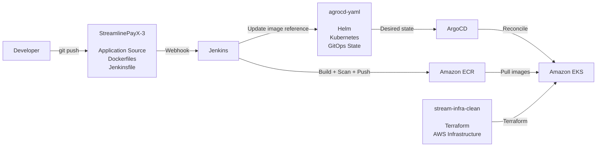
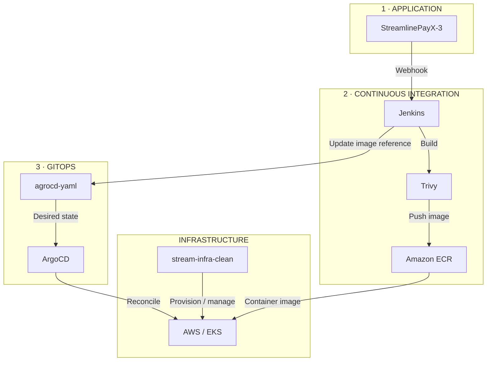

# StreamlinePay

### Kubernetes · AWS EKS · Terraform · Jenkins · ArgoCD · Helm · Docker · Trivy

**StreamlinePay is a containerized microservices platform running on Amazon EKS, with AWS infrastructure managed through Terraform and application delivery implemented through Jenkins CI and GitOps with ArgoCD.**

The platform is separated into three repositories:

* **`StreamlinePayX-3`** → Application source + Jenkins CI
* **`stream-infra-clean`** → AWS infrastructure + Terraform
* **`agrocd-yaml`** → Helm + Kubernetes + ArgoCD GitOps

---

# Architecture


```mermaid
flowchart LR

    DEV["Developer"]

    APP["StreamlinePayX-3<br/><br/>Application Source<br/>Dockerfiles<br/>Jenkinsfile"]

    JENKINS["Jenkins"]

    ECR["Amazon ECR"]

    GITOPS["agrocd-yaml<br/><br/>Helm<br/>Kubernetes<br/>GitOps State"]

    ARGO["ArgoCD"]

    INFRA["stream-infra-clean<br/><br/>Terraform<br/>AWS Infrastructure"]

    EKS["Amazon EKS"]

    DEV -->|"git push"| APP
    APP -->|"Webhook"| JENKINS

    JENKINS -->|"Build + Scan + Push"| ECR
    JENKINS -->|"Update image reference"| GITOPS

    GITOPS -->|"Desired state"| ARGO
    ARGO -->|"Reconcile"| EKS

    ECR -->|"Pull images"| EKS

    INFRA -->|"Terraform"| EKS
```

### The three repositories

```text
                         STREAMLINEPAY
                              │
          ┌───────────────────┼───────────────────┐
          │                   │                   │
          ▼                   ▼                   ▼

 ┌─────────────────┐  ┌─────────────────┐  ┌─────────────────┐
 │ StreamlinePayX-3│  │ stream-infra-   │  │ agrocd-yaml     │
 │                 │  │ clean           │  │                 │
 │ Application     │  │                 │  │ Helm            │
 │ Dockerfiles     │  │ Terraform       │  │ Kubernetes      │
 │ Jenkinsfile     │  │ AWS             │  │ ArgoCD          │
 └────────┬────────┘  └────────┬────────┘  └────────┬────────┘
          │                    │                     │
          ▼                    ▼                     ▼
       Jenkins             AWS / EKS              ArgoCD
          │                                          │
          ▼                                          ▼
      Amazon ECR ───────────────────────────────► Amazon EKS
```

The repositories have **separate responsibilities and lifecycles**, but work together as one delivery system.

| Repository           | Responsibility                  | Connection             |
| -------------------- | ------------------------------- | ---------------------- |
| `StreamlinePayX-3`   | Application source + Jenkins CI | Jenkins → ECR → GitOps |
| `stream-infra-clean` | AWS infrastructure + Terraform  | Terraform → AWS / EKS  |
| `agrocd-yaml`        | Helm + Kubernetes desired state | ArgoCD → EKS           |

---

# How the Three Repositories Work Together


```mermaid
flowchart TB

    subgraph APPLICATION["1 · APPLICATION"]
        APP["StreamlinePayX-3"]
    end

    subgraph CI["2 · CONTINUOUS INTEGRATION"]
        JENKINS["Jenkins"]
        TRIVY["Trivy"]
        ECR["Amazon ECR"]
    end

    subgraph GITOPS["3 · GITOPS"]
        REPO["agrocd-yaml"]
        ARGO["ArgoCD"]
    end

    subgraph INFRA["INFRASTRUCTURE"]
        TF["stream-infra-clean"]
        AWS["AWS / EKS"]
    end

    APP -->|"Webhook"| JENKINS
    JENKINS -->|"Build"| TRIVY
    TRIVY -->|"Push image"| ECR

    JENKINS -->|"Update image reference"| REPO
    REPO -->|"Desired state"| ARGO
    ARGO -->|"Reconcile"| AWS

    TF -->|"Provision / manage"| AWS
    ECR -->|"Container image"| AWS
```

The important distinction is:

```text
StreamlinePayX-3
        │
        │ application code
        ▼
     Jenkins
        │
        ├──────────────► Amazon ECR
        │
        │ image reference
        ▼
   agrocd-yaml
        │
        ▼
     ArgoCD
        │
        ▼
     Amazon EKS
```

While infrastructure follows its own path:

```text
stream-infra-clean
        │
        ▼
    Terraform
        │
        ▼
   AWS / EKS
```

---

# Delivery Flow

A change to the application follows this path:

```text
Developer
    │
    │ git push
    ▼
StreamlinePayX-3
    │
    │ webhook
    ▼
Jenkins
    │
    ├── Build Docker images
    │
    ├── Run Trivy scans
    │
    └── Push images
            │
            ▼
        Amazon ECR

Jenkins
    │
    │ update image reference
    ▼
agrocd-yaml
    │
    │ desired state
    ▼
ArgoCD
    │
    │ reconcile
    ▼
Amazon EKS
    │
    │ pull image
    ▼
Amazon ECR
```

**Jenkins handles the CI workflow and updates the deployment reference.
ArgoCD handles GitOps reconciliation.
Terraform manages the AWS infrastructure.**

---

# Repository 1: Application + CI

## `StreamlinePayX-3`

```text
StreamlinePayX-3/
│
├── cart-microservice/
├── products-microservice/
├── store-ui-microservice/
├── users-microservice/
│
├── Jenkinsfile
├── README.md
└── .gitignore
```

This repository contains the application source code and Jenkins pipeline.

The application components are containerized and built through Jenkins.

```text
Application Source
        │
        ▼
     Jenkins
        │
        ├── Docker Build
        │
        ├── Trivy Scan
        │
        └── Push
             │
             ▼
         Amazon ECR
```

---

# Repository 2: Infrastructure

## `stream-infra-clean`

```text
stream-infra-clean/
│
├── Terraform configuration
├── AWS resources
├── EKS infrastructure
├── IAM configuration
└── Supporting infrastructure
```

This repository manages the AWS infrastructure layer through Terraform.

```text
stream-infra-clean
        │
        ▼
    Terraform
        │
        ▼
       AWS
        │
        ├── Networking
        ├── IAM
        ├── EKS
        └── Supporting resources
```

The infrastructure repository is independent of the application delivery pipeline.

---

# Repository 3: GitOps

## `agrocd-yaml`

```text
agrocd-yaml/
│
├── Helm configuration
├── Kubernetes manifests
├── Application definitions
└── Deployment configuration
```

This repository contains the Kubernetes **desired state** used by ArgoCD.

```text
agrocd-yaml
      │
      │ desired state
      ▼
   ArgoCD
      │
      │ reconciliation
      ▼
   Amazon EKS
```

Jenkins updates the relevant deployment reference in this repository after building the application image.

ArgoCD then detects the Git change and reconciles the Kubernetes cluster toward that state.

---

# Application Structure

The application repository contains four containerized application components:

| Component               | Technology         | Role              |
| ----------------------- | ------------------ | ----------------- |
| `products-microservice` | Node.js / Express  | Product catalogue |
| `users-microservice`    | Python / FastAPI   | User management   |
| `cart-microservice`     | Java / Spring Boot | Shopping cart     |
| `store-ui-microservice` | React / Nginx      | Web frontend      |

Each component has its own application directory and Docker build context.

---

# Platform Components

| Component  | Role                             |
| ---------- | -------------------------------- |
| AWS EKS    | Kubernetes runtime               |
| Terraform  | Infrastructure as Code           |
| Jenkins    | Continuous Integration           |
| Docker     | Containerization                 |
| Amazon ECR | Container registry               |
| Trivy      | Container vulnerability scanning |
| Helm       | Kubernetes packaging             |
| ArgoCD     | GitOps reconciliation            |

---

# Engineering Model

The platform separates three concerns:

```text
┌──────────────────────────────────────────────────────┐
│                    APPLICATION                       │
│                                                      │
│                  StreamlinePayX-3                    │
│                         │                            │
│                         ▼                            │
│                      Jenkins                         │
│                         │                            │
│                         ▼                            │
│                     Amazon ECR                       │
└─────────────────────────┬────────────────────────────┘
                          │
                          │ image reference
                          ▼
┌──────────────────────────────────────────────────────┐
│                      GITOPS                          │
│                                                      │
│                    agrocd-yaml                       │
│                         │                            │
│                         ▼                            │
│                      ArgoCD                          │
└─────────────────────────┬────────────────────────────┘
                          │
                          │ reconcile
                          ▼
                    ┌───────────┐
                    │   EKS     │
                    └───────────┘
                          ▲
                          │
                          │ Terraform
                          │
┌─────────────────────────┴────────────────────────────┐
│                  INFRASTRUCTURE                      │
│                                                      │
│                 stream-infra-clean                   │
│                                                      │
│                     Terraform                        │
│                         │                            │
│                         ▼                            │
│                         AWS                          │
└──────────────────────────────────────────────────────┘
```

The separation keeps **application code, infrastructure code and deployment state independently version-controlled** while allowing them to operate as one delivery system.

---

# Current State

| Capability                         | Status      |
| ---------------------------------- | ----------- |
| Microservice application           | Implemented |
| Docker containerization            | Implemented |
| Jenkins CI                         | Implemented |
| Trivy scanning                     | Implemented |
| Amazon ECR                         | Implemented |
| Helm deployment configuration      | Implemented |
| GitOps repository                  | Implemented |
| ArgoCD workflow                    | Implemented |
| Terraform infrastructure           | Implemented |
| Kubernetes health-check refinement | In progress |
| Prometheus / Grafana               | Planned     |
| Centralized logging                | Planned     |

---

# Related Repositories

### Application + CI

`StreamlinePayX-3`

Application source, Dockerfiles and Jenkins pipeline.

### Infrastructure

`stream-infra-clean`

Terraform configuration for the AWS infrastructure.

### GitOps

`agrocd-yaml`

Helm and Kubernetes deployment configuration consumed by ArgoCD.

---

# Status

**Active portfolio project**

The platform continues to evolve around Kubernetes operations, deployment automation, observability and security.
