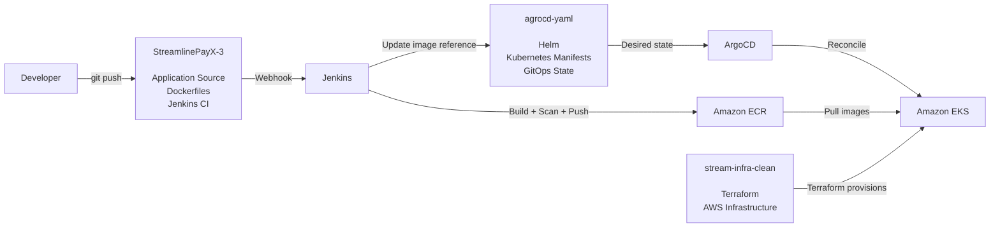
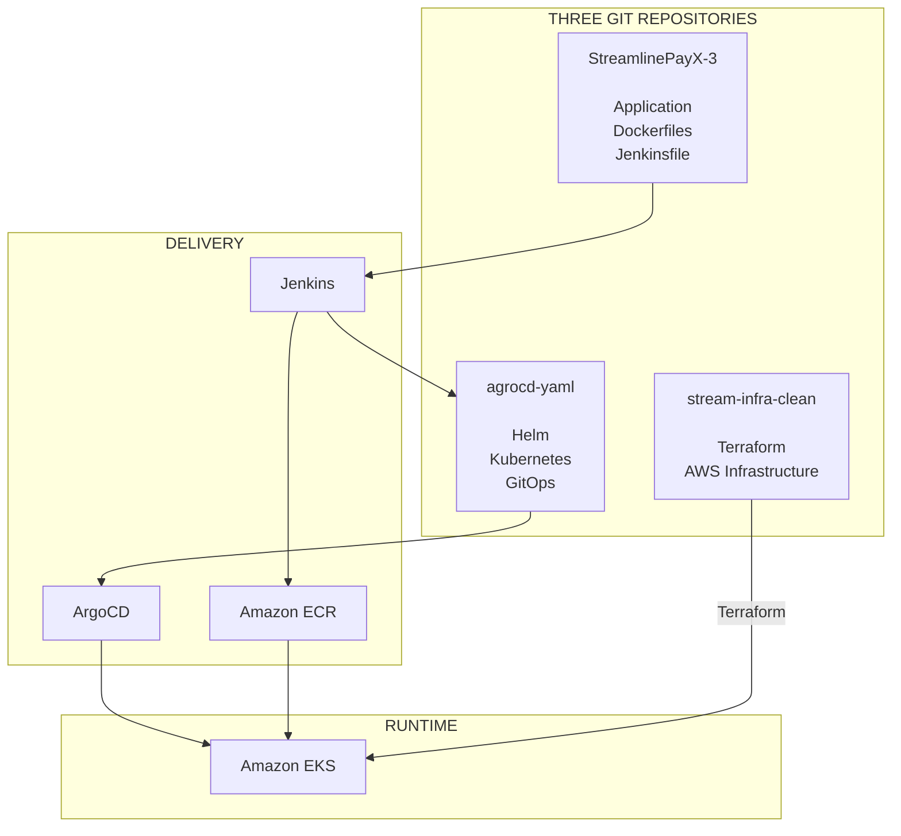

# StreamlinePay

### Kubernetes · AWS EKS · Terraform · Jenkins · ArgoCD · Helm · Docker · Trivy

**StreamlinePay is a containerized microservices platform running on Amazon EKS, with infrastructure managed through Terraform and application delivery through Jenkins CI and GitOps with ArgoCD.**

The project is intentionally split into **three repositories**, each with a distinct responsibility.

---

## Architecture


```mermaid
flowchart LR

    DEV["Developer"]

    APP["StreamlinePayX-3<br/><br/>Application Source<br/>Dockerfiles<br/>Jenkins CI"]

    INFRA["stream-infra-clean<br/><br/>Terraform<br/>AWS Infrastructure"]

    GITOPS["agrocd-yaml<br/><br/>Helm<br/>Kubernetes Manifests<br/>GitOps State"]

    JENKINS["Jenkins"]

    ECR["Amazon ECR"]

    ARGO["ArgoCD"]

    EKS["Amazon EKS"]

    DEV -->|"git push"| APP

    APP -->|"Webhook"| JENKINS

    JENKINS -->|"Build + Scan + Push"| ECR

    JENKINS -->|"Update image reference"| GITOPS

    GITOPS -->|"Desired state"| ARGO

    ARGO -->|"Reconcile"| EKS

    ECR -->|"Pull images"| EKS

    INFRA -->|"Terraform provisions"| EKS
```

### How the repositories connect

```text
                         STREAMLINEPAY
                              │
          ┌───────────────────┼───────────────────┐
          │                   │                   │
          ▼                   ▼                   ▼
 ┌─────────────────┐  ┌─────────────────┐  ┌─────────────────┐
 │ StreamlinePayX-3│  │ stream-infra-   │  │ agrocd-yaml     │
 │                 │  │ clean           │  │                 │
 │ Application     │  │                 │  │ Helm            │
 │ Dockerfiles     │  │ Terraform       │  │ Kubernetes      │
 │ Jenkinsfile     │  │ AWS             │  │ ArgoCD          │
 └────────┬────────┘  └────────┬────────┘  └────────┬────────┘
          │                    │                     │
          ▼                    ▼                     ▼
       Jenkins              AWS / EKS             ArgoCD
          │                                          │
          ▼                                          │
      Amazon ECR ────────────────────────────────────┘
                         container images
```

The three repositories have separate lifecycles:

| Repository           | Responsibility                       | Connects to            |
| -------------------- | ------------------------------------ | ---------------------- |
| `StreamlinePayX-3`   | Application source and Jenkins CI    | Jenkins → ECR → GitOps |
| `stream-infra-clean` | AWS infrastructure through Terraform | AWS / EKS              |
| `agrocd-yaml`        | Helm and Kubernetes desired state    | ArgoCD → EKS           |

---

## The Delivery Flow

The application repository is the starting point for a deployment.

```text
Developer
    │
    │ git push
    ▼
StreamlinePayX-3
    │
    │ webhook
    ▼
Jenkins
    │
    ├── Build Docker images
    │
    ├── Run Trivy scans
    │
    └── Push images
            │
            ▼
        Amazon ECR
            │
            │
Jenkins ─────┘
    │
    │ update image reference
    ▼
agrocd-yaml
    │
    │ desired state
    ▼
ArgoCD
    │
    │ reconcile
    ▼
Amazon EKS
    │
    │ pull image
    ▼
Amazon ECR
```

**Jenkins handles CI and updates the deployment reference.
ArgoCD handles GitOps reconciliation.
Terraform manages the underlying AWS infrastructure.**

---

## Repository 1: Application + CI

### `StreamlinePayX-3`

```text
StreamlinePayX-3/
│
├── cart-microservice/
├── products-microservice/
├── store-ui-microservice/
├── users-microservice/
│
├── Jenkinsfile
├── README.md
└── .gitignore
```

This repository contains the application source code and the Jenkins pipeline.

Jenkins uses this repository to:

```text
Source Code
     │
     ▼
Docker Build
     │
     ▼
Trivy Scan
     │
     ▼
Amazon ECR
```

---

## Repository 2: Infrastructure

### `stream-infra-clean`

```text
stream-infra-clean/
│
├── Terraform configuration
├── AWS resources
├── EKS infrastructure
├── IAM configuration
└── supporting infrastructure
```

This repository is responsible for the AWS infrastructure layer.

```text
Terraform
    │
    ▼
AWS
    │
    ├── Networking
    ├── IAM
    ├── EKS
    └── Supporting resources
```

Infrastructure changes are therefore separated from application delivery.

---

## Repository 3: GitOps

### `agrocd-yaml`

```text
agrocd-yaml/
│
├── Helm configuration
├── Kubernetes manifests
├── Application definitions
└── deployment configuration
```

This repository represents the **desired state** of the application running in Kubernetes.

```text
agrocd-yaml
     │
     ▼
  ArgoCD
     │
     ▼
  Amazon EKS
```

ArgoCD continuously compares the desired state in Git with the state running in the cluster and reconciles differences.

---

# Complete Relationship


```mermaid
flowchart TB

    subgraph REPOS["THREE GIT REPOSITORIES"]

        APP["StreamlinePayX-3<br/><br/>Application<br/>Dockerfiles<br/>Jenkinsfile"]

        INFRA["stream-infra-clean<br/><br/>Terraform<br/>AWS Infrastructure"]

        GITOPS["agrocd-yaml<br/><br/>Helm<br/>Kubernetes<br/>GitOps"]

    end

    subgraph DELIVERY["DELIVERY"]

        JENKINS["Jenkins"]

        ECR["Amazon ECR"]

        ARGO["ArgoCD"]

    end

    subgraph RUNTIME["RUNTIME"]

        EKS["Amazon EKS"]

    end

    APP --> JENKINS
    JENKINS --> ECR
    JENKINS --> GITOPS
    GITOPS --> ARGO
    ARGO --> EKS
    ECR --> EKS

    INFRA -->|"Terraform"| EKS
```

### In one sentence

> **StreamlinePayX-3 builds the application, `stream-infra-clean` builds the AWS foundation, and `agrocd-yaml` defines what should run on Kubernetes. Jenkins connects application changes to the GitOps repository, while ArgoCD connects that desired state to EKS.**

---

## Platform Components

| Component  | Role                                 |
| ---------- | ------------------------------------ |
| AWS EKS    | Kubernetes runtime                   |
| Terraform  | Infrastructure as Code               |
| Jenkins    | Continuous Integration               |
| Docker     | Containerization                     |
| Amazon ECR | Container registry                   |
| Trivy      | Container vulnerability scanning     |
| Helm       | Kubernetes packaging                 |
| ArgoCD     | GitOps deployment and reconciliation |

---

## Current State

| Capability                         | Status      |
| ---------------------------------- | ----------- |
| Microservice application           | Implemented |
| Docker containerization            | Implemented |
| Jenkins CI                         | Implemented |
| Trivy scanning                     | Implemented |
| Amazon ECR                         | Implemented |
| Helm deployment configuration      | Implemented |
| GitOps repository                  | Implemented |
| ArgoCD workflow                    | Implemented |
| Terraform infrastructure           | Implemented |
| Kubernetes health-check refinement | In progress |
| Prometheus / Grafana               | Planned     |
| Centralized logging                | Planned     |

---

## Engineering Model

The project follows a simple separation of concerns:

```text
APPLICATION
     │
     ▼
StreamlinePayX-3
     │
     ▼
   Jenkins
     │
     ├──────────────► Amazon ECR
     │
     ▼
GITOPS
     │
     ▼
agrocd-yaml
     │
     ▼
   ArgoCD
     │
     ▼
RUNTIME
     │
     ▼
Amazon EKS


INFRASTRUCTURE
     │
     ▼
stream-infra-clean
     │
     ▼
  Terraform
     │
     ▼
AWS / EKS
```

This separation keeps **application code, infrastructure code and deployment state independently version-controlled** while allowing them to work together as one delivery system.

---

## Related Repositories

* `StreamlinePayX-3` → Application + Jenkins CI
* `stream-infra-clean` → AWS + Terraform
* `agrocd-yaml` → Helm + ArgoCD GitOps

---

## Status

**Active portfolio project**

The platform continues to evolve around Kubernetes operations, deployment automation, observability and security.
