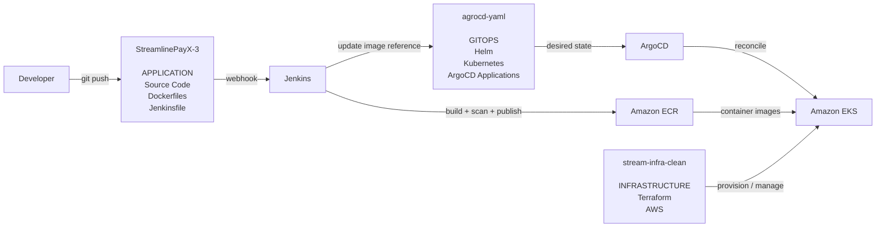

# StreamlinePay

### Kubernetes · AWS EKS · Terraform · Jenkins · ArgoCD · Helm · Docker · Trivy

**StreamlinePay is a containerized microservices platform designed for deployment on Amazon EKS, with infrastructure defined through Terraform and application delivery automated through Jenkins CI and GitOps with ArgoCD.**

The platform is separated into three repositories, each responsible for a different layer of the system.

---

## Architecture


```mermaid
flowchart LR

    DEV["Developer"]

    APP["StreamlinePayX-3<br/><br/>APPLICATION<br/>Source Code<br/>Dockerfiles<br/>Jenkinsfile"]

    JENKINS["Jenkins"]

    ECR["Amazon ECR"]

    GITOPS["agrocd-yaml<br/><br/>GITOPS<br/>Helm<br/>Kubernetes<br/>ArgoCD Applications"]

    ARGO["ArgoCD"]

    INFRA["stream-infra-clean<br/><br/>INFRASTRUCTURE<br/>Terraform<br/>AWS"]

    EKS["Amazon EKS"]

    DEV -->|"git push"| APP
    APP -->|"webhook"| JENKINS

    JENKINS -->|"build + scan + publish"| ECR
    JENKINS -->|"update image reference"| GITOPS

    GITOPS -->|"desired state"| ARGO
    ARGO -->|"reconcile"| EKS

    ECR -->|"container images"| EKS

    INFRA -->|"provision / manage"| EKS
```

### Three repositories. One delivery system.

| Repository                                                                  | Layer          | Responsibility                                                |
| --------------------------------------------------------------------------- | -------------- | ------------------------------------------------------------- |
| [`StreamlinePayX-3`](https://github.com/maxiemoses-eu/StreamlinePayX-3)     | Application    | Microservices, Dockerfiles and Jenkins CI                     |
| [`stream-infra-clean`](https://github.com/maxiemoses-eu/stream-infra-clean) | Infrastructure | Terraform and AWS infrastructure                              |
| [`agrocd-yaml`](https://github.com/maxiemoses-eu/agrocd-yaml)               | GitOps         | Helm charts, Kubernetes configuration and ArgoCD applications |

The repositories are independent, but connect through the delivery workflow:

```text
                    ┌──────────────────────┐
                    │   StreamlinePayX-3   │
                    │     Application      │
                    └──────────┬───────────┘
                               │
                               ▼
                           Jenkins
                               │
                    ┌──────────┴──────────┐
                    │                     │
                    ▼                     ▼
               Amazon ECR          agrocd-yaml
                    │                     │
                    │                     ▼
                    │                  ArgoCD
                    │                     │
                    └──────────┬──────────┘
                               ▼
                           Amazon EKS

                    stream-infra-clean
                               │
                               ▼
                           Terraform
                               │
                               ▼
                         AWS Infrastructure
```

---

## Application

The application repository contains four independently containerized components.

```text
StreamlinePayX-3/
│
├── cart-microservice/
├── products-microservice/
├── store-ui-microservice/
├── users-microservice/
│
├── Jenkinsfile
├── README.md
└── .gitignore
```

| Component               | Technology         | Role              |
| ----------------------- | ------------------ | ----------------- |
| `products-microservice` | Node.js / Express  | Product catalogue |
| `users-microservice`    | Python / FastAPI   | User management   |
| `cart-microservice`     | Java / Spring Boot | Shopping cart     |
| `store-ui-microservice` | React / Nginx      | Frontend          |

The root `Jenkinsfile` coordinates the CI workflow for the application components.

---

## CI/CD

A source change enters the delivery system through the application repository.

```text
GitHub
   │
   ▼
Jenkins
   │
   ├── Checkout
   ├── Build
   ├── Docker images
   ├── Trivy scan
   └── Push to ECR
             │
             ▼
          Amazon ECR
```

The pipeline then updates the image reference in the GitOps repository.

```text
Jenkins
   │
   │ image reference
   ▼
agrocd-yaml
   │
   ▼
ArgoCD
   │
   ▼
Amazon EKS
```

This separates **image creation** from **Kubernetes deployment**.

Jenkins produces and publishes the application artifacts. ArgoCD is responsible for reconciling the Kubernetes desired state.

---

## Infrastructure

Infrastructure is maintained separately in:

### `stream-infra-clean`

```text
stream-infra-clean/
│
├── environments/
│   └── prod/
│
├── modules/
│
├── backend.tf
├── main.tf
├── provider.tf
├── variable.tf
├── outputs.tf
├── Jenkinsfile
└── Jenkinsfile Destroy
```

The repository uses reusable Terraform modules and environment-specific configuration. It also includes remote-state configuration and separate infrastructure workflows.

The infrastructure lifecycle is independent from application delivery:

```text
Terraform
    │
    ▼
AWS Infrastructure
    │
    └── Amazon EKS
```

---

## GitOps

The Kubernetes deployment layer is maintained in:

### `agrocd-yaml`

```text
agrocd-yaml/
│
├── chart/
│
├── stream-application/
│
└── README.md
```

The repository contains Helm-based deployment configuration and ArgoCD application definitions for the StreamlinePay services.

ArgoCD watches this repository and uses the declared configuration as the desired state for the cluster.

```text
Git
 │
 ▼
agrocd-yaml
 │
 ▼
ArgoCD
 │
 ▼
EKS
```

---

## Security

Container security is integrated into the CI workflow.

**Trivy** scans the built container images before they are pushed to Amazon ECR. The GitOps workflow then promotes the resulting image reference through the deployment configuration.

The resulting chain is:

```text
Source
  ↓
Build
  ↓
Scan
  ↓
ECR
  ↓
GitOps
  ↓
ArgoCD
  ↓
EKS
```

---

## Kubernetes

The GitOps repository packages the services for Kubernetes using Helm.

The deployment configuration includes Kubernetes resources such as Deployments, Services, configuration and service accounts, with application-specific values maintained through Helm.

The deployment model is therefore:

```text
Helm configuration
       │
       ▼
    ArgoCD
       │
       ▼
   Amazon EKS
```

---

## Repository Boundaries

The architecture deliberately keeps the three layers separate:

```text
┌──────────────────────────────────────────────────────┐
│                    APPLICATION                       │
│                                                      │
│                  StreamlinePayX-3                    │
│              Source + Docker + Jenkins               │
└─────────────────────────┬────────────────────────────┘
                          │
                          ▼
                    Amazon ECR
                          │
                          ▼
┌──────────────────────────────────────────────────────┐
│                      GITOPS                          │
│                                                      │
│                    agrocd-yaml                       │
│               Helm + Kubernetes + ArgoCD             │
└─────────────────────────┬────────────────────────────┘
                          │
                          ▼
                      Amazon EKS
                          ▲
                          │
┌─────────────────────────┴────────────────────────────┐
│                  INFRASTRUCTURE                      │
│                                                      │
│                 stream-infra-clean                   │
│                       Terraform                      │
└──────────────────────────────────────────────────────┘
```

This gives each repository a clear boundary:

* **Application** owns the code and CI workflow.
* **Infrastructure** owns AWS resources.
* **GitOps** owns the desired Kubernetes state.

---

## Engineering Focus

The project brings together:

* **AWS EKS** for Kubernetes orchestration
* **Terraform** for infrastructure as code
* **Jenkins** for CI automation
* **Docker** for containerization
* **Amazon ECR** for image storage
* **Trivy** for container security scanning
* **Helm** for Kubernetes packaging
* **ArgoCD** for GitOps delivery

---

## Current State

| Capability                         | Status      |
| ---------------------------------- | ----------- |
| Microservice application           | Implemented |
| Docker containerization            | Implemented |
| Jenkins CI                         | Implemented |
| Trivy scanning                     | Implemented |
| Amazon ECR integration             | Implemented |
| Helm deployment configuration      | Implemented |
| GitOps repository                  | Implemented |
| ArgoCD deployment workflow         | Implemented |
| Terraform infrastructure           | Implemented |
| Kubernetes health-check refinement | In progress |
| Prometheus / Grafana               | Planned     |
| Centralized logging                | Planned     |

---

## Related Repositories

### Application

[`StreamlinePayX-3`](https://github.com/maxiemoses-eu/StreamlinePayX-3)

Application source, Dockerfiles and Jenkins CI.

### Infrastructure

[`stream-infra-clean`](https://github.com/maxiemoses-eu/stream-infra-clean)

Terraform configuration and AWS infrastructure.

### GitOps

[`agrocd-yaml`](https://github.com/maxiemoses-eu/agrocd-yaml)

Helm, Kubernetes deployment configuration and ArgoCD applications.

---

## Status

**Active portfolio project**

StreamlinePay is being iterated across Kubernetes operations, CI/CD, GitOps, infrastructure automation, container security and observability.
# StreamlinePay

### Kubernetes · AWS EKS · Terraform · Jenkins · ArgoCD · Helm · Docker · Trivy

**StreamlinePay is a containerized microservices platform designed for deployment on Amazon EKS, with infrastructure defined through Terraform and application delivery automated through Jenkins CI and GitOps with ArgoCD.**

The platform is separated into three repositories, each responsible for a different layer of the system.

---

## Architecture


```mermaid
flowchart LR

    DEV["Developer"]

    APP["StreamlinePayX-3<br/><br/>APPLICATION<br/>Source Code<br/>Dockerfiles<br/>Jenkinsfile"]

    JENKINS["Jenkins"]

    ECR["Amazon ECR"]

    GITOPS["agrocd-yaml<br/><br/>GITOPS<br/>Helm<br/>Kubernetes<br/>ArgoCD Applications"]

    ARGO["ArgoCD"]

    INFRA["stream-infra-clean<br/><br/>INFRASTRUCTURE<br/>Terraform<br/>AWS"]

    EKS["Amazon EKS"]

    DEV -->|"git push"| APP
    APP -->|"webhook"| JENKINS

    JENKINS -->|"build + scan + publish"| ECR
    JENKINS -->|"update image reference"| GITOPS

    GITOPS -->|"desired state"| ARGO
    ARGO -->|"reconcile"| EKS

    ECR -->|"container images"| EKS

    INFRA -->|"provision / manage"| EKS
```

### Three repositories. One delivery system.

| Repository                                                                  | Layer          | Responsibility                                                |
| --------------------------------------------------------------------------- | -------------- | ------------------------------------------------------------- |
| [`StreamlinePayX-3`](https://github.com/maxiemoses-eu/StreamlinePayX-3)     | Application    | Microservices, Dockerfiles and Jenkins CI                     |
| [`stream-infra-clean`](https://github.com/maxiemoses-eu/stream-infra-clean) | Infrastructure | Terraform and AWS infrastructure                              |
| [`agrocd-yaml`](https://github.com/maxiemoses-eu/agrocd-yaml)               | GitOps         | Helm charts, Kubernetes configuration and ArgoCD applications |

The repositories are independent, but connect through the delivery workflow:

```text
                    ┌──────────────────────┐
                    │   StreamlinePayX-3   │
                    │     Application      │
                    └──────────┬───────────┘
                               │
                               ▼
                           Jenkins
                               │
                    ┌──────────┴──────────┐
                    │                     │
                    ▼                     ▼
               Amazon ECR          agrocd-yaml
                    │                     │
                    │                     ▼
                    │                  ArgoCD
                    │                     │
                    └──────────┬──────────┘
                               ▼
                           Amazon EKS

                    stream-infra-clean
                               │
                               ▼
                           Terraform
                               │
                               ▼
                         AWS Infrastructure
```

---

## Application

The application repository contains four independently containerized components.

```text
StreamlinePayX-3/
│
├── cart-microservice/
├── products-microservice/
├── store-ui-microservice/
├── users-microservice/
│
├── Jenkinsfile
├── README.md
└── .gitignore
```

| Component               | Technology         | Role              |
| ----------------------- | ------------------ | ----------------- |
| `products-microservice` | Node.js / Express  | Product catalogue |
| `users-microservice`    | Python / FastAPI   | User management   |
| `cart-microservice`     | Java / Spring Boot | Shopping cart     |
| `store-ui-microservice` | React / Nginx      | Frontend          |

The root `Jenkinsfile` coordinates the CI workflow for the application components.

---

## CI/CD

A source change enters the delivery system through the application repository.

```text
GitHub
   │
   ▼
Jenkins
   │
   ├── Checkout
   ├── Build
   ├── Docker images
   ├── Trivy scan
   └── Push to ECR
             │
             ▼
          Amazon ECR
```

The pipeline then updates the image reference in the GitOps repository.

```text
Jenkins
   │
   │ image reference
   ▼
agrocd-yaml
   │
   ▼
ArgoCD
   │
   ▼
Amazon EKS
```

This separates **image creation** from **Kubernetes deployment**.

Jenkins produces and publishes the application artifacts. ArgoCD is responsible for reconciling the Kubernetes desired state.

---

## Infrastructure

Infrastructure is maintained separately in:

### `stream-infra-clean`

```text
stream-infra-clean/
│
├── environments/
│   └── prod/
│
├── modules/
│
├── backend.tf
├── main.tf
├── provider.tf
├── variable.tf
├── outputs.tf
├── Jenkinsfile
└── Jenkinsfile Destroy
```

The repository uses reusable Terraform modules and environment-specific configuration. It also includes remote-state configuration and separate infrastructure workflows.

The infrastructure lifecycle is independent from application delivery:

```text
Terraform
    │
    ▼
AWS Infrastructure
    │
    └── Amazon EKS
```

---

## GitOps

The Kubernetes deployment layer is maintained in:

### `agrocd-yaml`

```text
agrocd-yaml/
│
├── chart/
│
├── stream-application/
│
└── README.md
```

The repository contains Helm-based deployment configuration and ArgoCD application definitions for the StreamlinePay services.

ArgoCD watches this repository and uses the declared configuration as the desired state for the cluster.

```text
Git
 │
 ▼
agrocd-yaml
 │
 ▼
ArgoCD
 │
 ▼
EKS
```

---

## Security

Container security is integrated into the CI workflow.

**Trivy** scans the built container images before they are pushed to Amazon ECR. The GitOps workflow then promotes the resulting image reference through the deployment configuration.

The resulting chain is:

```text
Source
  ↓
Build
  ↓
Scan
  ↓
ECR
  ↓
GitOps
  ↓
ArgoCD
  ↓
EKS
```

---

## Kubernetes

The GitOps repository packages the services for Kubernetes using Helm.

The deployment configuration includes Kubernetes resources such as Deployments, Services, configuration and service accounts, with application-specific values maintained through Helm.

The deployment model is therefore:

```text
Helm configuration
       │
       ▼
    ArgoCD
       │
       ▼
   Amazon EKS
```

---

## Repository Boundaries

The architecture deliberately keeps the three layers separate:

```text
┌──────────────────────────────────────────────────────┐
│                    APPLICATION                       │
│                                                      │
│                  StreamlinePayX-3                    │
│              Source + Docker + Jenkins               │
└─────────────────────────┬────────────────────────────┘
                          │
                          ▼
                    Amazon ECR
                          │
                          ▼
┌──────────────────────────────────────────────────────┐
│                      GITOPS                          │
│                                                      │
│                    agrocd-yaml                       │
│               Helm + Kubernetes + ArgoCD             │
└─────────────────────────┬────────────────────────────┘
                          │
                          ▼
                      Amazon EKS
                          ▲
                          │
┌─────────────────────────┴────────────────────────────┐
│                  INFRASTRUCTURE                      │
│                                                      │
│                 stream-infra-clean                   │
│                       Terraform                      │
└──────────────────────────────────────────────────────┘
```

This gives each repository a clear boundary:

* **Application** owns the code and CI workflow.
* **Infrastructure** owns AWS resources.
* **GitOps** owns the desired Kubernetes state.

---

## Engineering Focus

The project brings together:

* **AWS EKS** for Kubernetes orchestration
* **Terraform** for infrastructure as code
* **Jenkins** for CI automation
* **Docker** for containerization
* **Amazon ECR** for image storage
* **Trivy** for container security scanning
* **Helm** for Kubernetes packaging
* **ArgoCD** for GitOps delivery

---

## Current State

| Capability                         | Status      |
| ---------------------------------- | ----------- |
| Microservice application           | Implemented |
| Docker containerization            | Implemented |
| Jenkins CI                         | Implemented |
| Trivy scanning                     | Implemented |
| Amazon ECR integration             | Implemented |
| Helm deployment configuration      | Implemented |
| GitOps repository                  | Implemented |
| ArgoCD deployment workflow         | Implemented |
| Terraform infrastructure           | Implemented |
| Kubernetes health-check refinement | In progress |
| Prometheus / Grafana               | Planned     |
| Centralized logging                | Planned     |

---

## Related Repositories

### Application

[`StreamlinePayX-3`](https://github.com/maxiemoses-eu/StreamlinePayX-3)

Application source, Dockerfiles and Jenkins CI.

### Infrastructure

[`stream-infra-clean`](https://github.com/maxiemoses-eu/stream-infra-clean)

Terraform configuration and AWS infrastructure.

### GitOps

[`agrocd-yaml`](https://github.com/maxiemoses-eu/agrocd-yaml)

Helm, Kubernetes deployment configuration and ArgoCD applications.

---

## Status

**Active portfolio project**

StreamlinePay is being iterated across Kubernetes operations, CI/CD, GitOps, infrastructure automation, container security and observability.
