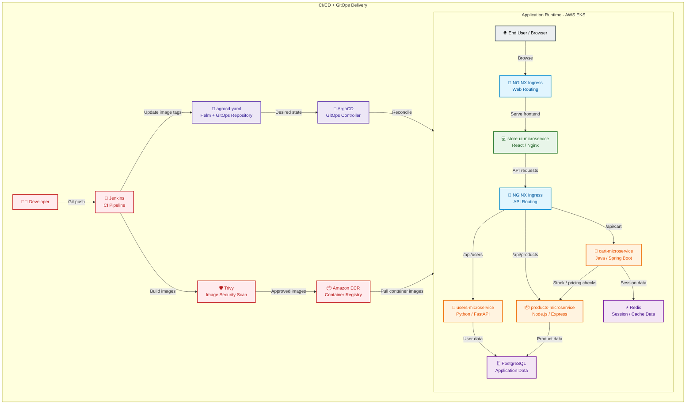

# StreamlinePay

A Kubernetes-based microservices platform built to demonstrate AWS infrastructure, containerization, CI/CD, GitOps deployment, security scanning, and infrastructure automation.

StreamlinePay was rebuilt around a clear separation of concerns:

* **Application** — microservices and frontend
* **Infrastructure** — AWS resources managed with Terraform
* **Deployment** — Helm manifests managed through GitOps
* **CI** — Jenkins builds, scans, publishes, and updates deployment configuration
* **CD** — ArgoCD reconciles Git changes into the EKS cluster

---

## Architecture


```mermaid
graph TB

    %% =========================
    %% RUNTIME ARCHITECTURE
    %% =========================

    subgraph Runtime["Application Runtime - AWS EKS"]

        User["🌐 End User / Browser"]

        WebIngress["🚦 NGINX Ingress<br/>Web Routing"]

        UI["💻 store-ui-microservice<br/>React / Nginx"]

        APIIngress["🚦 NGINX Ingress<br/>API Routing"]

        Users["🔑 users-microservice<br/>Python / FastAPI"]

        Cart["🛒 cart-microservice<br/>Java / Spring Boot"]

        Products["📦 products-microservice<br/>Node.js / Express"]

        PostgreSQL["🗄️ PostgreSQL<br/>Application Data"]

        Redis["⚡ Redis<br/>Session / Cache Data"]

        User -->|Browse| WebIngress
        WebIngress -->|Serve frontend| UI
        UI -->|API requests| APIIngress

        APIIngress -->|/api/users| Users
        APIIngress -->|/api/cart| Cart
        APIIngress -->|/api/products| Products

        Users -->|User data| PostgreSQL
        Products -->|Product data| PostgreSQL
        Cart -->|Session data| Redis
        Cart -->|Stock / pricing checks| Products

    end


    %% =========================
    %% DELIVERY ARCHITECTURE
    %% =========================

    subgraph Delivery["CI/CD + GitOps Delivery"]

        Developer["👨‍💻 Developer"]

        Jenkins["🔴 Jenkins<br/>CI Pipeline"]

        Trivy["🛡️ Trivy<br/>Image Security Scan"]

        ECR["📦 Amazon ECR<br/>Container Registry"]

        GitOps["📁 agrocd-yaml<br/>Helm + GitOps Repository"]

        ArgoCD["🔄 ArgoCD<br/>GitOps Controller"]

        Developer -->|Git push| Jenkins

        Jenkins -->|Build images| Trivy
        Trivy -->|Approved images| ECR

        Jenkins -->|Update image tags| GitOps

        GitOps -->|Desired state| ArgoCD

        ArgoCD -->|Reconcile| Runtime

        ECR -->|Pull container images| Runtime

    end


    %% =========================
    %% STYLING
    %% =========================

    classDef client fill:#eceff1,stroke:#37474f,stroke-width:2px,color:#000;
    classDef edge fill:#e1f5fe,stroke:#0288d1,stroke-width:2px,color:#01579b;
    classDef ui fill:#e8f5e9,stroke:#2e7d32,stroke-width:2px,color:#1b5e20;
    classDef service fill:#fff3e0,stroke:#ef6c00,stroke-width:2px,color:#e65100;
    classDef data fill:#f3e5f5,stroke:#7b1fa2,stroke-width:2px,color:#4a148c;
    classDef ci fill:#ffebee,stroke:#c62828,stroke-width:2px,color:#b71c1c;
    classDef gitops fill:#ede7f6,stroke:#5e35b1,stroke-width:2px,color:#311b92;

    class User client;
    class WebIngress,APIIngress edge;
    class UI ui;
    class Users,Cart,Products service;
    class PostgreSQL,Redis data;
    class Developer,Jenkins,Trivy,ECR ci;
    class GitOps,ArgoCD gitops;
```

## What the Architecture Demonstrates

The project separates **application runtime** from **software delivery**.

### Application Runtime

Users access the frontend through NGINX Ingress. The frontend communicates with backend services through the API routing layer.

The backend consists of:

* **products-microservice** — Node.js / Express
* **users-microservice** — Python / FastAPI
* **cart-microservice** — Java / Spring Boot
* **store-ui-microservice** — React / Nginx frontend

The services run as containers on Kubernetes/EKS.

### Delivery Pipeline

A code push triggers Jenkins.

Jenkins:

1. Checks out the source code
2. Builds the container images in parallel
3. Scans the images with Trivy
4. Pushes approved images to Amazon ECR
5. Updates image references in the GitOps repository

ArgoCD watches the GitOps repository and reconciles the desired state into the EKS cluster.

This keeps **CI responsible for building and publishing** while **ArgoCD is responsible for deployment and reconciliation**.

---

## How It Works

### 1. Development

```text
Developer
   ↓
Git push
   ↓
GitHub
   ↓
Jenkins webhook
```

### 2. Continuous Integration

```text
Jenkins
   ↓
Checkout
   ↓
Parallel Docker builds
   ↓
Trivy security scans
   ↓
Amazon ECR
```

Images are tagged using the Git commit SHA so deployments can reference a specific build.

### 3. GitOps Deployment

```text
Jenkins
   ↓
Update image tags
   ↓
agrocd-yaml
   ↓
ArgoCD
   ↓
AWS EKS
```

Git remains the source of truth for the desired deployment state.

### 4. Rollback

Deployment configuration can be reverted through Git:

```bash
git revert <commit>
```

ArgoCD can then reconcile the reverted state.

---

## Repository Structure

StreamlinePay is intentionally split into three repositories.

### Application + CI

`StreamlinePayX-3`

Contains:

* Microservice source code
* Frontend application
* Dockerfiles
* Jenkins pipeline

### Infrastructure

`stream-infra-clean`

Contains Terraform configuration for the AWS infrastructure supporting the platform.

### GitOps Deployment

`agrocd-yaml`

Contains:

* Helm configuration
* Kubernetes deployment configuration
* ArgoCD application definitions
* Environment-specific image references

This separation keeps **application code, infrastructure, and deployment configuration independently managed**.

---

## Services

| Component               | Technology         | Responsibility  |
| ----------------------- | ------------------ | --------------- |
| `products-microservice` | Node.js / Express  | Product catalog |
| `users-microservice`    | Python / FastAPI   | User management |
| `cart-microservice`     | Java / Spring Boot | Shopping cart   |
| `store-ui-microservice` | React / Nginx      | Frontend        |

Each service has its own Dockerfile and is built independently by the CI pipeline.

---

## Technology Stack

### Cloud

* AWS
* Amazon EKS
* Amazon ECR
* IAM
* VPC

### Containers & Orchestration

* Docker
* Kubernetes
* NGINX Ingress

### CI/CD

* Jenkins
* GitHub
* Webhooks
* Declarative Jenkins Pipeline

### GitOps

* ArgoCD
* Helm
* Git

### Infrastructure as Code

* Terraform

### Security

* Trivy
* IAM least-privilege principles

### Application & Data

* React
* Node.js / Express
* Python / FastAPI
* Java / Spring Boot
* PostgreSQL
* Redis

---

## Security Controls

The pipeline incorporates security checks before container images are published.

### Container Scanning

Trivy scans container images during the Jenkins pipeline.

Images that fail the configured vulnerability threshold do not proceed through the pipeline.

### IAM

AWS access is designed around least-privilege permissions, limiting the CI process to the AWS resources it needs.

### Immutable Image References

Images are tagged using Git commit identifiers rather than relying only on mutable tags such as `latest`.

This makes it possible to associate a deployment with a specific source revision.

### Git as the Deployment Control Plane

Deployment configuration is stored in Git, providing:

* Change history
* Reviewable configuration changes
* Traceable deployments
* Git-based rollback

---

## Quick Start

### Clone the Repository

```bash
git clone https://github.com/maxiemoses-eu/StreamlinePayX-3.git

cd StreamlinePayX-3
```

### Build the Services

Generate the current commit identifier:

```bash
COMMIT=$(git rev-parse --short HEAD)
```

Build the application images:

```bash
docker build -t products-microservice:$COMMIT ./products-microservice

docker build -t users-microservice:$COMMIT ./users-microservice

docker build -t cart-microservice:$COMMIT ./cart-microservice

docker build -t store-ui-microservice:$COMMIT ./store-ui-microservice
```

### Push to Amazon ECR

Authenticate Docker with ECR:

```bash
aws ecr get-login-password --region us-east-1 | \
docker login \
  --username AWS \
  --password-stdin ACCOUNT_ID.dkr.ecr.us-east-1.amazonaws.com
```

Example:

```bash
docker tag products-microservice:$COMMIT \
ACCOUNT_ID.dkr.ecr.us-east-1.amazonaws.com/products-microservice:$COMMIT

docker push \
ACCOUNT_ID.dkr.ecr.us-east-1.amazonaws.com/products-microservice:$COMMIT
```

The Jenkins pipeline automates the build, scan, push, and GitOps update process.

---

## Jenkins Pipeline

The Jenkins pipeline follows this sequence:

```text
1. Checkout source
       ↓
2. Build container images in parallel
       ↓
3. Scan images with Trivy
       ↓
4. Push images to Amazon ECR
       ↓
5. Update Helm image references
       ↓
6. Commit changes to GitOps repository
       ↓
7. ArgoCD detects Git change
       ↓
8. ArgoCD reconciles EKS
```

The important separation is:

**Jenkins builds and publishes.
ArgoCD deploys and reconciles.**

---

## Troubleshooting

### Check Kubernetes Workloads

```bash
kubectl get pods -n streamlinepay
```

### Inspect a Pod

```bash
kubectl describe pod <pod-name> -n streamlinepay
```

### View Application Logs

```bash
kubectl logs -f <pod-name> -n streamlinepay
```

### Check ArgoCD Synchronization

```bash
argocd app sync <application-name>
```

### Investigate Jenkins Failures

Check:

* Jenkins console output
* GitHub webhook delivery
* Docker build logs
* Trivy scan results
* ECR push output
* GitOps repository changes

---

## Current Status

| Area                          | Status            |
| ----------------------------- | ----------------- |
| Application containers        | Implemented       |
| Jenkins CI pipeline           | Implemented       |
| Parallel image builds         | Implemented       |
| Trivy image scanning          | Implemented       |
| Amazon ECR integration        | Implemented       |
| GitOps repository             | Implemented       |
| Helm deployment configuration | Implemented       |
| ArgoCD deployment flow        | Implemented       |
| AWS infrastructure            | Terraform-managed |
| Health-check troubleshooting  | In progress       |
| Prometheus / Grafana          | Planned           |
| Centralized logging           | Planned           |

Some application health checks still require troubleshooting around ports and/or probe configuration.

Observability improvements are planned as a subsequent stage rather than being presented as completed functionality.

---

## What I Learned

Building StreamlinePay gave me practical experience with the relationship between application development and infrastructure automation.

The project required working across:

* Linux
* Git and GitHub
* Docker
* Jenkins
* Kubernetes
* AWS EKS
* Amazon ECR
* IAM
* Terraform
* Helm
* ArgoCD
* Trivy
* PostgreSQL
* Redis

More importantly, it gave me experience separating:

**Infrastructure → Application → CI → Deployment**

instead of treating deployment as a single pipeline.

---

## Related Repositories

**StreamlinePayX-3**
Application source code and Jenkins CI pipeline.

**stream-infra-clean**
AWS infrastructure managed with Terraform.

**agrocd-yaml**
Helm deployment configuration and ArgoCD GitOps resources.

---

## Further Reading

I documented the architectural decisions, challenges, and rebuild process in the accompanying case study:

**How I Rebuilt StreamlinePay: A Complete AWS DevOps and GitOps Case Study**

---

## Author

**Maxie Moses**

DevOps / Cloud Infrastructure Learner

[GitHub](https://github.com/maxiemoses-eu) · [LinkedIn](https://www.linkedin.com/in/maxie-moses-a-26a2788b/) · [Medium](https://medium.com/@MaxieMoses)

---

## Project Status

**Portfolio project — actively maintained**

The project is being iterated on as I continue improving the deployment workflow, observability, security, and Kubernetes configuration.
